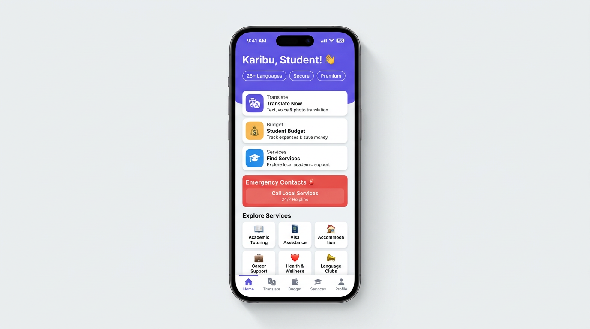
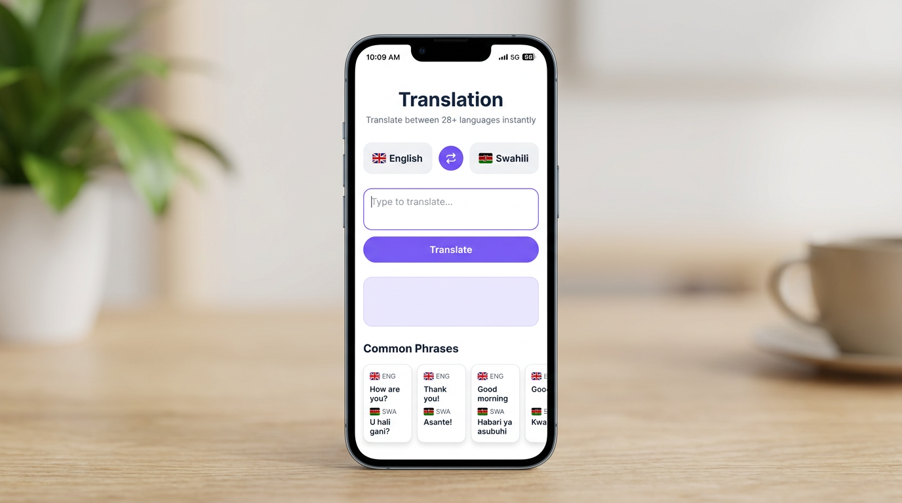

# EduBridge Mobile

> A comprehensive React Native mobile app helping international students navigate life in Kenya.


---

## Overview

EduBridge Mobile is a cross-platform mobile application built with **React Native** and **Expo** that serves as a daily companion for international students studying in Kenya. It provides real-time translation, budget tracking, local service discovery, emergency contacts, and seamless integration with the EduBridge admin dashboard.

**Created by:** OLAME BARHIBONERA Eben  
**Project Type:** Final Year Project (2025/2026)

---

## Screenshots

| Home Screen | Translation | Welcome |
|:-----------:|:-----------:|:-------:|
|  |  |  |

---

## Features

### Core Features

- **28+ Language Translation** — Real-time translation between 28+ languages (English, Swahili, French, Chinese, Arabic, Spanish, Portuguese, German, Japanese, Korean, Hindi, Kinyarwanda, Kirundi, and more). Powered by MyMemory Translation API with auto-translate as you type.
- **Budget Tracker** — Track income and expenses in KES with categories, visual breakdowns, and financial summaries designed for student life.
- **Local Services Directory** — Find hospitals, banks, embassies, transport, restaurants, and essential services near you.
- **Emergency Contacts** — Quick-dial emergency services (Police, Ambulance, Fire) directly from the app.
- **Live Announcements** — Receive real-time announcements from the admin dashboard with priority indicators.

### Authentication & Profile

- **Supabase Authentication** — Email/password sign-in, OAuth (Google, Facebook), email confirmation flow.
- **User Profiles** — Comprehensive profiles with university, course, phone, language preference, and role management.
- **Admin Access** — Admin users can navigate to the admin dashboard directly from the profile screen.

### UX & Design

- **Animated Welcome Onboarding** — 5-slide animated onboarding introducing app features and the creator. Only shows on first launch.
- **Multi-Theme Support** — Light, Dark, Chocolate, and Pink themes with full color system.
- **Modern Bottom Tab Bar** — Animated tab bar with active indicators, outlined/filled icon states, and subtle highlights.
- **Responsive Design** — Adapts to iOS and Android with platform-specific padding and behavior.

---

## Tech Stack

| Technology | Purpose |
|:-----------|:--------|
| React Native | Cross-platform mobile framework |
| Expo SDK 54 | Development tooling and native APIs |
| TypeScript | Type-safe development |
| Supabase | Authentication, Database (PostgreSQL), Realtime |
| React Navigation 7 | Stack and tab navigation |
| AsyncStorage | Local persistence (onboarding state, preferences) |
| MyMemory API | Real-time translation service |
| Expo Clipboard | Copy translated text |
| Expo Linking | Deep links and phone calls |
| Expo Secure Store | Secure token storage |

---

## Project Structure

```
EduBridge mobile/
├── App.tsx                        # Root component with providers
├── package.json
├── tsconfig.json
├── docs/
│   └── screenshots/               # App screenshots
└── src/
    ├── components/
    │   ├── MobileLayout.tsx        # Custom bottom tab bar
    │   └── ThemeSelector.tsx       # Theme picker component
    ├── contexts/
    │   ├── AuthContext.tsx          # Supabase auth + profile management
    │   ├── ThemeContext.tsx         # Theme state management
    │   └── index.ts
    ├── navigation/
    │   ├── RootNavigator.tsx       # Main navigator with onboarding
    │   └── navigationRef.ts        # Navigation reference for deep linking
    ├── screens/
    │   ├── WelcomeScreen.tsx       # Animated onboarding (5 slides)
    │   ├── LoginScreen.tsx         # Email/password + OAuth login
    │   ├── SignUpScreen.tsx         # Multi-step registration
    │   ├── AuthCallbackScreen.tsx  # OAuth callback handler
    │   ├── HomeScreen.tsx          # Dashboard with announcements
    │   ├── TranslateScreen.tsx     # 28+ language translation
    │   ├── BudgetScreen.tsx        # Income/expense tracker
    │   ├── ServicesScreen.tsx      # Local services directory
    │   ├── ProfileScreen.tsx       # User profile & settings
    │   └── AdminDashboardScreen.tsx # Admin navigation bridge
    ├── theme/
    │   └── colors.ts               # Theme color definitions
    └── utils/
        └── supabase.ts             # Supabase client initialization
```

---

## Getting Started

### Prerequisites

- Node.js >= 18
- npm or yarn
- Expo CLI (`npx expo`)
- Expo Go app (for testing on physical device)

### Installation

```bash
# Clone the repository
cd "EduBridge mobile"

# Install dependencies
npm install

# Start the development server
npx expo start
```

### Environment Setup

The app connects to a shared Supabase project. The Supabase URL and anon key are configured in `src/utils/supabase.ts`. For production, set these via environment variables.

---

## Database Schema

The mobile app shares the same Supabase database as the admin dashboard. Key tables:

| Table | Purpose |
|:------|:--------|
| `profiles` | User profiles (name, university, course, role, status) |
| `translations` | Verified translation phrases |
| `announcements` | Admin-broadcasted announcements |
| `services` | Local service listings |
| `transactions` | Budget/financial records |
| `app_settings` | Platform configuration |
| `activity_log` | Audit trail |

All tables use **Row Level Security (RLS)** — students can only read their own data, while admins have full access.

---

## Translation API

The app uses the **MyMemory Translation API** for real-time translation:

- **Endpoint:** `https://api.mymemory.translated.net/get`
- **Languages:** 28+ including English, Swahili, French, Spanish, Portuguese, German, Italian, Dutch, Russian, Chinese, Japanese, Korean, Arabic, Hindi, Turkish, Polish, Ukrainian, Vietnamese, Thai, Indonesian, Malay, Amharic, Yoruba, Zulu, Kinyarwanda, Kirundi, Luganda, Somali
- **Features:** Auto-translate on typing (debounced 600ms), copy to clipboard, searchable language picker

---

## Color Themes

| Theme | Primary | Accent | Card |
|:------|:--------|:-------|:-----|
| Light | `#ffffff` | `#8b5cf6` | `#ffffff` |
| Dark | `#111827` | `#60a5fa` | `#1f2937` |
| Chocolate | `#443329` | `#f59e0b` | `#573e2d` |
| Pink | `#fdf2f8` | `#ec4899` | `#ffffff` |

---

## Related Projects

- **[EduBridge Dashboard](../EduBridge-dashboard/)** — Admin web dashboard for managing the platform

---

## License

This project is part of a final year academic submission.

**&copy; 2025-2026 OLAME BARHIBONERA Eben**
